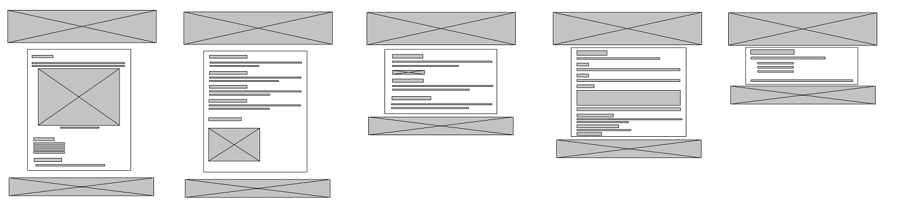
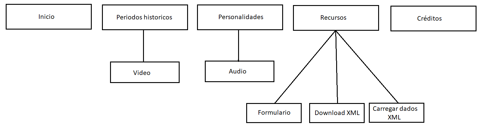

# Relatório do Projeto: História da Educação em Portugal

**Grupo:** inf24tig32  
**Elementos:**  
- Daniel Ribeiro (a046437)  
- Gonçalo Miranda (a046446)  
- Tiago Rodrigues (a047910)

## 1. Tema e Objetivos do Trabalho

O tema escolhido foi a **História da Educação em Portugal**, com o objetivo de dar a conhecer os principais marcos históricos, personalidades e evoluções do sistema educativo português. O projeto teve como objetivos:

- Criar um website informativo, acessível e visualmente apelativo.
- Utilizar tecnologias Web (HTML, CSS, JavaScript, XML) para estruturar e dinamizar o conteúdo.
- Aplicar boas práticas de marcação, estilo e interatividade.
- Incluir elementos obrigatórios como tabelas, listas, formulários, imagens, estilos CSS e integração com ficheiros XML.

## 2. Estrutura do Site

O site é composto pelas seguintes páginas:

- `index.html` – Página inicial com introdução ao tema e imagem histórica.
- `periodos.html` – Apresenta os principais períodos históricos da educação.
- `personalidades.html` – Destaque de personalidades influentes na educação portuguesa.
- `recursos.html` – Inclui um formulário de contacto e integração com ficheiro XML.
- `tabela.html` – Página que mostra dados carregados dinamicamente a partir de XML com JavaScript.
- `creditos.html` – Lista dos autores do projeto e seus números de aluno.

## Wireframe (exemplo visual)

Abaixo apresentamos o wireframe das páginas principais do site, feito para planear a estrutura antes da implementação:

## Sitemap

Representação gráfica do mapa de navegação do site:

## 3. Produto

### Descrição
O site apresenta:
- Informação histórica e figuras relevantes
- Multimédia (áudio, vídeo, imagens)
- Tabela gerada a partir de XML
- Formulário de contacto com validação

### Publicação
- Repositório GitHub: [https://github.com/inf24tig32/historia-educacao](#)
- Site Netlify: [https://inf24tig32.netlify.app](#)

### Instalação
- **Local:** Abrir qualquer `.html` num navegador
- **Netlify:** Fazer deploy da pasta no painel de controlo

### Navegação e Acessibilidade
- Menu consistente em todas as páginas
- Legendas em imagens (`figcaption`)
- Tooltips e estrutura clara

### Validações
- Formulário com campos obrigatórios 
- Email validado (`type="email"`)
- Testes feitos nos validadores da W3C:
  - HTML: https://validator.w3.org/
  - CSS: https://jigsaw.w3.org/css-validator/
- XML validado com o `schema.xsd`

### Requisitos cumpridos
- 4 páginas com HTML semântico
- Tabela com `thead`, `tbody`, `tfoot`, `rowspan`, `colspan`
- Listas aninhadas, destaques com CSS 
- Formulário funcional
- Integração de XML com JavaScript
- Estilos com todos os tipos de seletores
- Elementos multimédia: vídeo e áudio

## 4. Apresentação

Durante a apresentação:
- Mostramos o site publicado no Netlify
- Utilizamos slideshow com relatório
